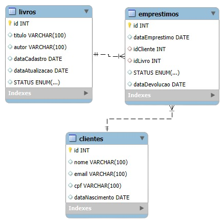

# 📚 LivrariaApp

Olá galera! O **LivrariaApp** é um sistema em Java para gerenciamento de uma biblioteca, oferecendo funcionalidades completas para **cadastrar, atualizar, listar, pesquisar e excluir** **clientes**, **livros** e **empréstimos**. Desenvolvido com uma arquitetura modular baseada em camadas e acesso a banco de dados MySQL via JDBC, o sistema é executado totalmente via terminal, com menus intuitivos e operações encadeadas.

---

## 📦 Estrutura Modular

O sistema é dividido de forma clara em **Model**, **Repository**, **Service** e **View** para seguir os princípios da responsabilidade única:

- **Model**: define os atributos e comportamentos das entidades principais: `Cliente`, `Livro`, `Emprestimo`.
- **Repository**: faz a comunicação com o banco de dados, usando JDBC para realizar operações CRUD.
- **Service**: responsável pela lógica de negócio e validações.
- **View**: menus interativos no terminal para o usuário realizar ações.
- **config**: gerenciamento da conexão com o banco de dados.

---

## 🔍 Funcionalidades em Detalhe

### 👤 Cliente
- Cadastrar novo cliente com nome, email, CPF e data de nascimento.
- Atualizar informações de clientes existentes.
- Pesquisar cliente por ID.
- Excluir cliente do banco de dados.

### 📘 Livro
- Cadastrar novo livro com título, autor e status.
- Atualizar dados do livro, incluindo sua disponibilidade.
- Pesquisar livro por ID.
- Excluir livro do banco de dados.

### 🔄 Empréstimo
- Cadastrar empréstimo de um livro para um cliente
- Realizar devolução
- Pesquisar empréstimo por ID.
- Excluir empréstimo do banco do banco de dados.

### 📚 Biblioteca
- Listar todos os clientes
- Listar todos os livros
- Listar todos os empréstimos

---

## 🧠 Lógica de Negócio

- Um livro não pode ser emprestado se estiver indisponível.
- Ao devolver um livro, seu status é automaticamente atualizado para "Disponível".
- Datas de cadastro e atualização são geradas automaticamente com base na data atual.
- Todos os dados são formatados no padrão brasileiro para exibição no terminal.
- Mensagens descritivas para facilitar a usabilidade
- Código limpo e modularizado

---

## 🗃️ Banco de Dados

A conexão com o banco de dados é feita via JDBC. As credenciais são carregadas dinamicamente do arquivo `database.properties`. Segue abaixo o DER:



---

## 🛠️ Tecnologias Utilizadas
- 
- 
- 
- 

---

## ▶️ Execução

### Pré-requisitos
- Java 11 ou superior
- MySQL configurado e rodando
- Arquivo `database.properties` com configurações corretas


## 🔧 Configuração do Banco

Adicione o arquivo `database.properties` na pasta **resources**:
```properties
db.url=jdbc:mysql://localhost:3306/livraria
db.user=root
db.password=senha
```

---

### Passos:
```bash
git clone https://github.com/CaiquePirs/sistema_livraria.git
cd LivrariaApp
javac LivrariaApp.java
java LivrariaApp
```
---

## 📚 Possibilidades de Expansão

- Integração com uma interface gráfica (JavaFX ou Swing)
- API REST para comunicação externa
- Geração de relatórios (PDF, CSV)
- Autenticação de usuários

---

## 👨‍💻 Autor
O LivrariaApp foi desenvolvido por mim, contribuições são bem-vindas! Para reportar bugs ou sugerir melhorias, entre em contato ou abra uma issue.

## 📧 Contato
[](mailto:pirescaiq@gmail.com)
[](https://www.linkedin.com/in/caique-pires-8843aa332)